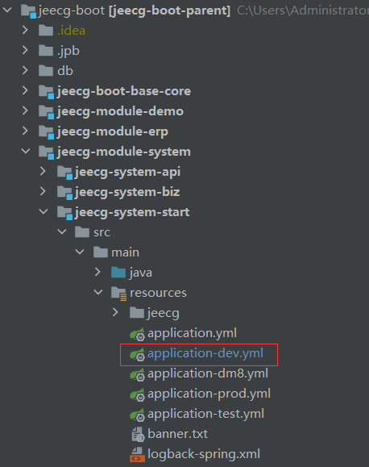
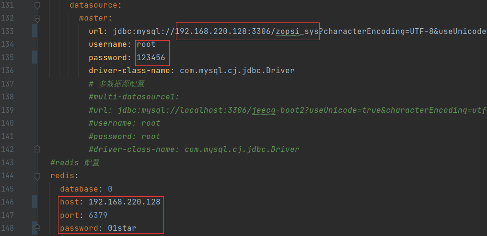
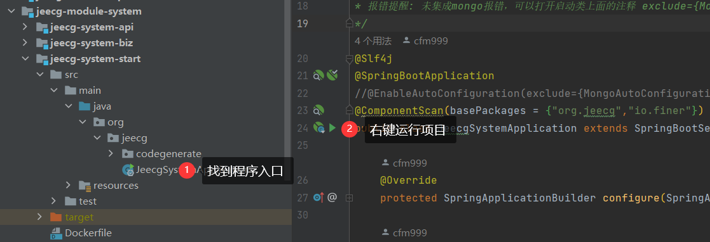
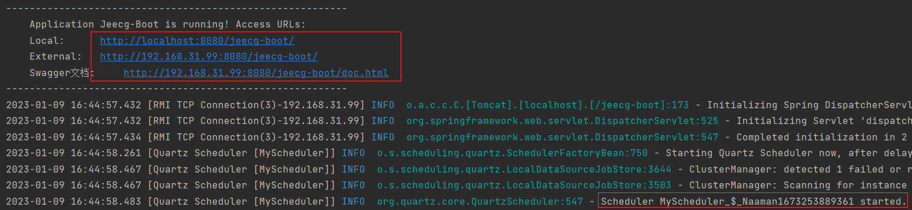
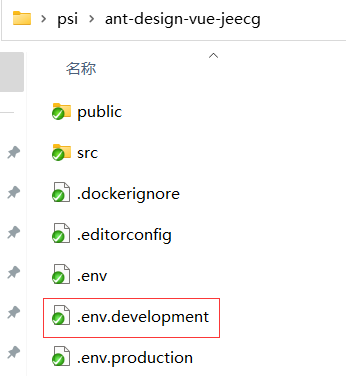
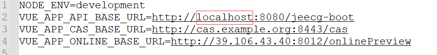
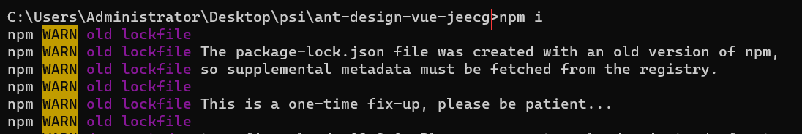
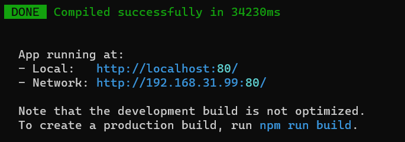
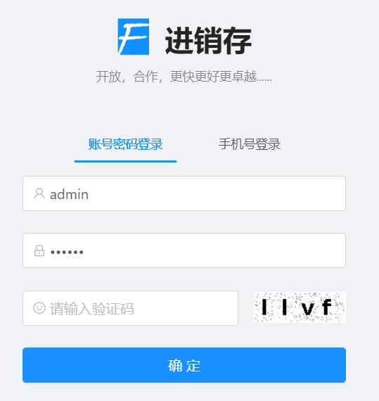
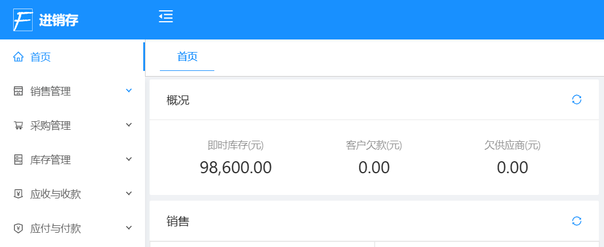

# 参考项目搭建教程

本教程用于搭建本地运行项目，用于分析业务流程，由于源码没有开放所以功能，所以还是需要通过在线项目演示来分析业务流程。

## 1 准备代码和数据库

克隆代码到本地：https://gitee.com/FINERME/psi.git

执行`sql`目录下面的数据库脚本，构建数据库、表、视图等等，注意仔细阅读`sql`目录下面的`README.md`。

## 2 搭建后端

将后端项目（`jeecg-boot`目录）导入到IDEA中，然后修改对应配置启动项目即可。

### 2.1 找到配置文件

启动项目配置所在位置，如下图所示：



### 2.2 修改配置文件

主要修改配置文件中的mysql和redis的配置，如下图所示



### 2.3 编译运行项目



运行成功如下图所示



## 3 搭建前端

### 3.1 修改npm全局配置

```powershell
npm config set registry https://registry.npm.taobao.org --global
npm config set disturl https://npm.taobao.org/dist --global
```

进入前端项目目录（`ant-design-vue-jeecg`），找到开发环境配置，如下图所示



修改URL地址，修改内容如下图所示



当然你也可以不修改，不修改此时连接的服务器是线上示例服务器

### 3.2 启动前端

启动前需要先按照JavaScript库依赖，进入到前端项目目录执行安装指令

```powershell
npm i
```



执行`npm run serve`命令启动项目



### 3.3 测试访问

访问地址为：http://localhost:80，就会看到登录页面。



现在可以测试登录了，下面是账号：

- 管理员账号：admin/123456

登录成功界面


